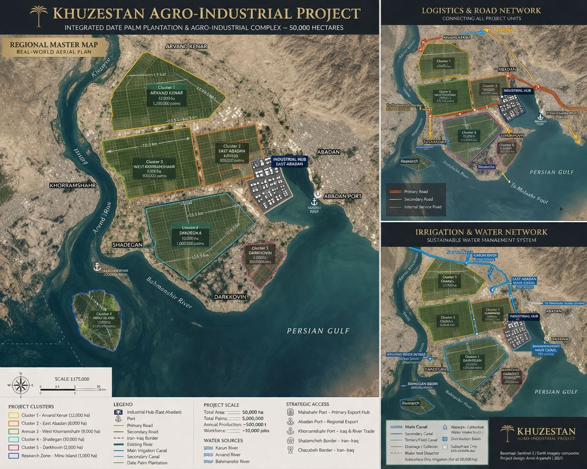

# 🤝 Strategic Partners – Khuzestan Agro-Industrial Project

  

---

## 🌍 Partnership Strategy

The project is designed as a collaborative platform, integrating international expertise, regional capabilities, and local execution.

Partnerships will be structured across four key domains:

- Agricultural development  
- Irrigation and water management  
- Industrial processing  
- Engineering and infrastructure  

---

## 🌱 Agricultural & Plantation Partners

Potential partners for large-scale cultivation and agronomy:

- Date palm nurseries (Iran: Khuzestan, Bushehr, Hormozgan, Fars)  
- Agricultural research centers  
- Private plantation developers  

### Role:
- Seedling production  
- Plantation management  
- Crop optimization  

---

## 💧 Irrigation & Water Systems

Specialized partners for irrigation infrastructure:

- Netafim (drip irrigation systems)  
- Rivulis  
- Local irrigation contractors  

### Role:
- Subsurface irrigation design  
- Water efficiency optimization  
- Large-scale irrigation deployment  

---

## 🏭 Industrial & Processing Partners

Industrial partners for value-chain integration:

- Date processing companies  
- Food & packaging companies  
- Ethanol production technology providers  
- Feed production companies  

### Role:
- Processing plant development  
- Technology transfer  
- Industrial operations  

---

## 🏗 Engineering & Infrastructure

Engineering and EPC-level collaboration:

- Industrial engineering firms  
- Construction contractors  
- Infrastructure developers  

### Role:
- Canal construction  
- Road network development  
- Industrial zone construction  

---

## 🚢 Logistics & Export Partners

Strategic logistics support:

- Port operators (Mahshahr, Abadan, Khorramshahr)  
- Export companies  
- Regional distributors  

### Role:
- Export handling  
- Supply chain optimization  
- Market access  

---

## 🤝 Investment & Strategic Partners

We are open to:

- Institutional investors  
- Strategic industrial investors  
- Joint venture partners  
- Agricultural investment funds  

---

## 🎯 Partnership Model

The project will be developed through:

- Joint ventures  
- EPC contracts  
- Long-term operational partnerships  
- Strategic equity participation  

---

## 🚀 Conclusion

The strength of this project lies in its collaborative structure.

By combining regional resources with international expertise, the project is positioned for scalable growth, operational efficiency, and long-term success.
