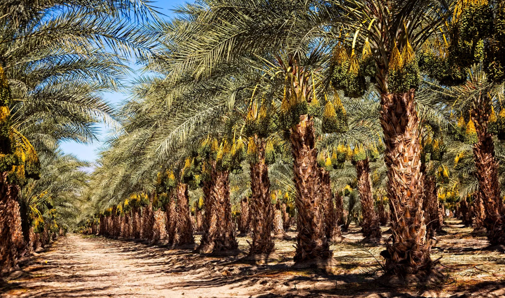

  

# 🌴 Khuzestan Agro-Industrial Project

🚀 A 50,000-hectare integrated agro-industrial investment opportunity in Khuzestan, Iran.
Large-scale date palm plantation and agro-industrial project in Khuzestan, Iran.
Integrated Date Palm Valley Project.

## 📌 Executive Summary

A large-scale, export-oriented agro-industrial project designed to position Khuzestan as a leading hub for date production and processing in the Middle East.

## 🧩 Overview

This project proposes the development of a large-scale integrated date palm plantation and agro-industrial ecosystem in Khuzestan Province, Iran.

The project spans approximately 50,000 hectares across strategic zones near:

- Khorramshahr  
- Abadan  
- Shadegan  
- Darkhovin  

It combines:

- Industrial-scale agriculture
- Agro-processing industries
- Export infrastructure

  

## 📍 Project Master Plan

High-level zoning of plantation areas, logistics routes, and industrial hub positioning across Khuzestan region.

![Project Map]
(https://github.com/user-attachments/assets/ab49c1e0-2b89-44dd-aa37-789e30cd57a1)

  ## 🎯 Objectives

- Establish 5 million date palm trees
- Develop agro-industrial value chains
- Create 10,000+ jobs
- Enable export-oriented production

## 📊 Project Scale

- Total Area: 50,000 hectares
- Total Palms: 5,000,000
- Annual Production: ~500,000 tons
- Workforce: ~10,000 employees

## 🗺️ Geographic Clusters

| Cluster | Location | Area | Palms |
|--------|---------|------|------|
| 1 | Arvand Kenar | 12,000 ha | 1,200,000 |
| 2 | East Abadan | 8,000 ha | 800,000 |
| 3 | West Khorramshahr | 9,000 ha | 900,000 |
| 4 | Shadegan (Selective) | 10,000 ha | 1,000,000 |
| 5 | Darkhovin | 2,000 ha | 200,000 |
| Research | Minu Island | 1,000 ha | 100,000 |

## 💧 Water Strategy

- Subsurface drip irrigation
- Daily demand: 600,000 m³
- Sources:
  - Karun River  
  - Arvand River  
  - Bahmanshir River  

## 🏗️ Infrastructure

- Main canals: 150 km
- Drainage system: 400 km
- Roads: 420 km

## 🏭 Industrial Zone

📍 Main Hub: East Abadan  

📍 Export & Logistics Network:

- Mahshahr Port (Primary Export Hub – international shipping)
- Abadan Port (fast access, regional export)
- Khorramshahr Port (river & Iraq trade access)

- Land Routes:
  - Shalamcheh Border (Iran–Iraq)
  - Chazabeh Border (Iran–Iraq)

This multi-channel logistics structure enables flexible, low-cost, and high-volume export to both global and regional markets.

This positioning transforms the project into a regional agro-export hub with direct access to both global markets and high-demand neighboring countries.

## 🏭 Industrial Facilities

These facilities ensure full value-chain integration, maximizing product value and minimizing waste.

- Date processing plant
- Ethanol production
- Animal feed production
- Date paste & confectionery
- Advanced packaging

  
## 💡 Why Invest?

- Large-scale agricultural opportunity in a high-demand global market  
- Strategic export access via Persian Gulf and Iraq  
- Integrated value chain ensuring higher margins  
- Strong labor availability and regional expertise  
- Scalable infrastructure with long-term growth potential  
- Positioned for high scalability and long-term export growth

  
## 💰 Investment

### Plantation
- $9,500 per hectare
- Total: ~$475 million

### Industrial
- ~$700–900 million

## 📈 Revenue

- Estimated: $400M – $700M annually

## ⏱️ ROI

- Conservative: 8–10 years  
- Optimized: 6–8 years  

## 🌍 Strategic Advantages

- Direct access to water resources  
- Proximity to Persian Gulf export routes  
- Suitable climate for date cultivation  
- Large-scale integrated design  
- Strong labor availability  

## 🧠 Open Collaboration

We invite:

- Agricultural engineers  
- Irrigation specialists  
- Industrial engineers  
- GIS experts  
- Investors  

## 👤 Founder

Arvin Arpanahi

- 14+ years experience in accounting
- Experience in industrial & agricultural sectors
- Field knowledge of Khorramshahr & Abadan region

## 🚀 Vision

To transform Khuzestan into a regional agro-industrial hub and a leading exporter of date-based products.
