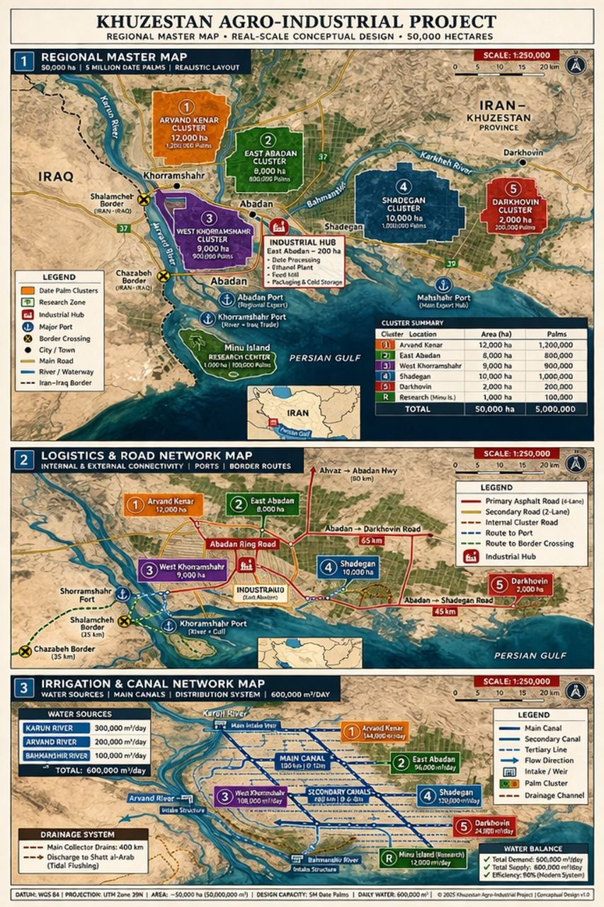

# Khuzestan Agro-Industrial Date Palm Project

## Quick Overview

A large-scale date palm plantation and agro-industrial platform designed for export-oriented production, combining agricultural development, water infrastructure, and industrial processing in Khuzestan, Iran.

---

## Project Structure

- [Project Concept](01-project-concept.md)
- [Technical Design](02-technical-design.md)
- [Land & Water Strategy](03-land-water-strategy.md)
- [Supply Chain](04-supply-chain.md)
- [Market Analysis](05-market-analysis.md)
- [Financial Model](06-financial-model.md)
- [Environmental Impact](07-environmental-impact.md)
- [Risk Analysis](08-risk-analysis.md)
- [Implementation Roadmap](09-implementation-roadmap.md)
- [Team](10-team.md)
- [Partners](11-partners.md)
- [Investor Deck](12-deck.md)

---

## Executive Summary

This project presents the development of a large-scale date palm plantation integrated with agro-industrial processing infrastructure in Khuzestan.

The objective is to transform traditional agriculture into a scalable, export-driven industrial platform with strong long-term economic potential.

---

## Master Plan Overview

- Full land allocation strategy  
- Plantation zoning  
- Infrastructure layout  
- Expansion capability  

---

## Plantation Development

- Large-scale cultivation  
- Optimized yield per hectare  
- Long-term productivity  
- Mechanized farming  

---

## Water & Irrigation System

- Efficient irrigation network  
- Sustainable water usage  
- Long-term supply planning  

---

## Infrastructure & Logistics

- Internal road systems  
- Transport and logistics planning  
- Access to export routes  

---

## Strategic Vision

To build a high-efficiency agro-industrial system that integrates:

- Plantation  
- Water infrastructure  
- Processing  
- Export logistics  

---

## Investment Highlights

- Strong global demand for dates  
- Export-driven revenue model  
- Scalable infrastructure  
- Long-term agricultural stability  

---

## Competitive Advantage

- Strategic location (Khuzestan)  
- Integrated system design  
- Efficient resource use  
- Export market access  

---

## Development Phases

- Phase 1: Land & infrastructure  
- Phase 2: Plantation development  
- Phase 3: Processing facilities  
- Phase 4: Export scaling  

---

## Conclusion

This project represents a high-potential agro-industrial investment opportunity combining land, water, and supply chain infrastructure into a scalable export platform.

---

## Investor Access

👉 [Investor Deck](12-deck.md)
